% Ya sé Python. ¿Ahora qué? :relaxed:
% Miguel Sánchez de León Peque
% 2019-10-04


# Presentación

## ¡Hola! :wave:

- [Miguel Sánchez de León Peque](https://www.linkedin.com/in/peque)
- [OpenSistemas](http://www.opensistemas.com)
- Analista/científico de datos
- Programación, datos y aprendizaje máquina
- Python :heart:

## Taller

> **Objetivo**: preparación para contribuir a proyectos libres del ecosistema de Python y compartir los nuestros

- Repaso de herramientas/servicios
- Poca profundización
- Interactivo (a ver qué tal)

## Cubriremos :book:

- Metodologías de desarrollo
- Servicios de control de versiones
- Entornos virtuales (`venv`)
- Herramientas de testeo
- Sistemas de integración continua
- Herramientas y servicios de documentación
- Distribución de paquetes
- Otros gestores de entornos virtuales
- ...

## Requisitos :computer:

- Python nivel básico
- Git nivel básico
- Python 3.6+, Git 2.0+, gitk

## Encuesta rápida

- ¿Quién ha hecho ya algún *pull request*?
- ¿Quién ha utilizado `pytest` y Travis?
- ¿Quién documenta sus proyectos?


# Metodologías de desarrollo

## Hay 3 metodologías de desarrollo

. . .

{width=80%}

## La nuestra

- TDD
- Desarrollo en `master`
- Todo código es revisado
- Integración continua
- Trabajo con *forks*

## ¿Es la buena? :joy:

- Muy utilizada
- La más común en proyectos libres
- Aplicable a cualquier proyecto

## TDD :white_check_mark:

. . .

#. Escribimos el test
#. Escribimos el código
#. "Limpiamos"

## Desarrollo en `master`

. . .

Flujos:

- ~~Git *flow*~~
- GitHub
- Gitlab

---

{width=50%}

## GitHub


## Gitlab

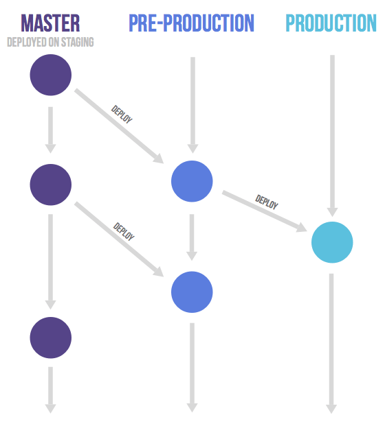{width=50%}

---

{width=50%}

## Revisiones :+1:

- *Pull/merge requests*
- Discusiones
- Comentarios sobre el código

## Integración continua

- Pequeños cambios
- Infraestructura (validación, estilo...)

## *Fork*

- Grupo/organización vs. usuario
- Limpieza
- Seguridad
- Permisos

## Compartir repositorio


# Servicios de control de versiones

## ¿Qué opciones hay?


## Hoy... :tada:

{width=50%}


# Primer *commit* :baby:

## Nuevo repositorio

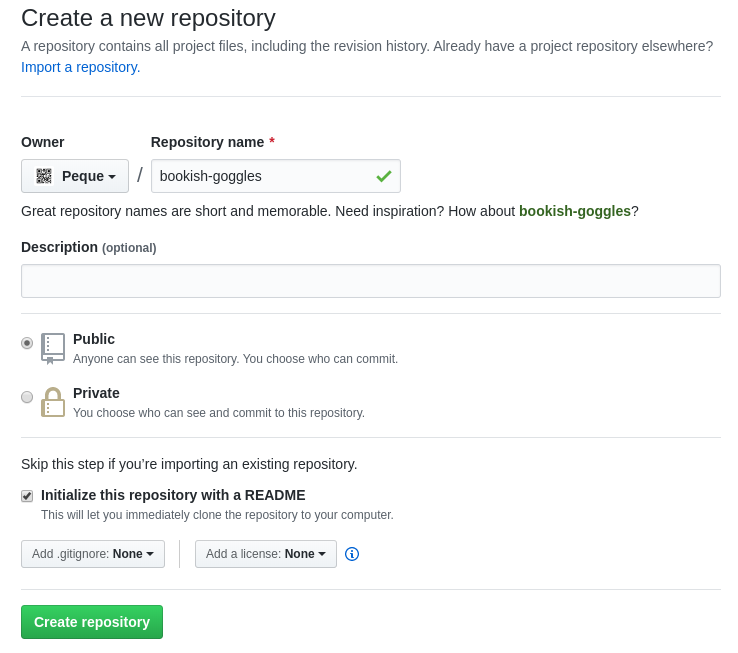{width=60%}

## *Commit* inicial

```bash
git clone git@github.com:my_user/project.git
cd project/
```

```bash
git config --global user.name "Pepito Grillo"
git config --global user.email "pepito@grillo.com"
```

```bash
git branch -a
git status

# Edit README.md
git add README.md
git commit
git push origin master
```

## Claves SSH :lock:

- [¿Tenemos?](https://help.github.com/en/articles/checking-for-existing-ssh-keys)
- [Creamos y añadimos](https://help.github.com/en/articles/generating-a-new-ssh-key-and-adding-it-to-the-ssh-agent)
- [Subimos a GitHub](https://help.github.com/en/articles/adding-a-new-ssh-key-to-your-github-account)

# Primer *pull request* :muscle:

## *Fork*!

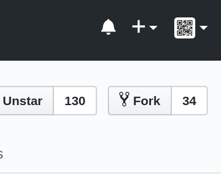

## Clonación :sheep:

```bash
git clone git@github.com:my_user/other.git
cd other
git remote add upstream https://github.com/other_user/other.git
git remote -v
```

## Comandos de Git

```bash
gitk --all &
```

```bash
git fetch <remote>
git branch <name>
git checkout <name>
```

```bash
git push <remote> <name>
```

## Objetivo :dart:

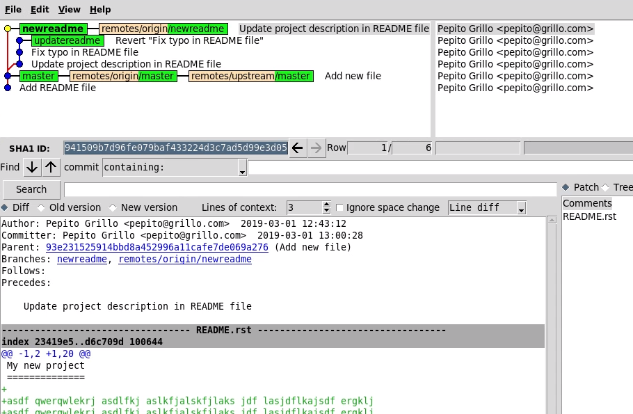{width=80%}

## *Pull request*!

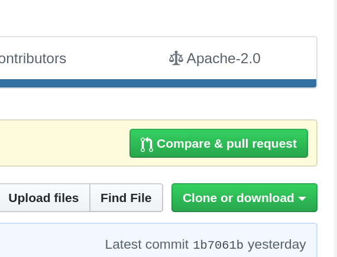{width=50%}

## Detalles

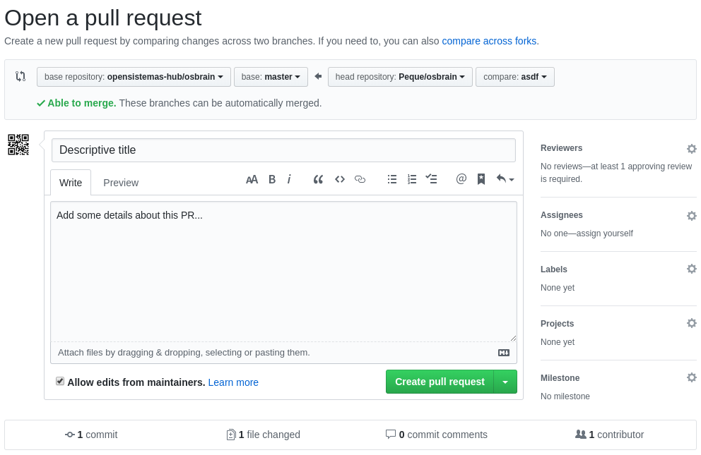{width=80%}

## *PR* abierto

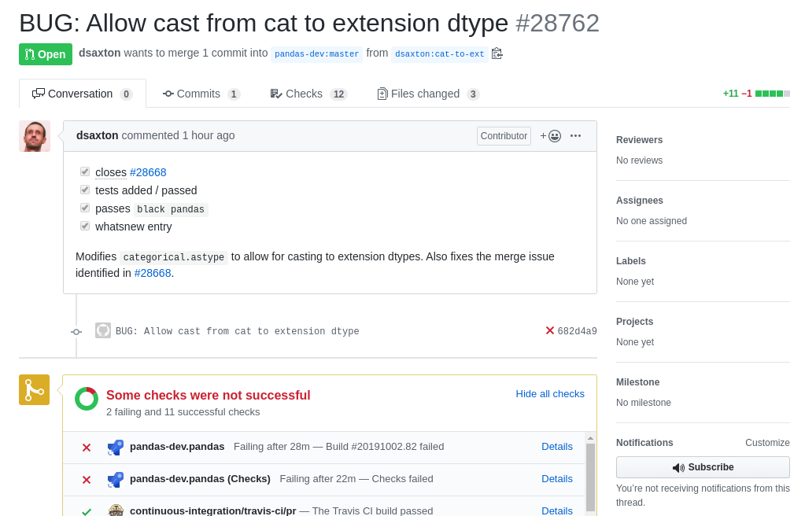{width=80%}

## Revisión :+1:

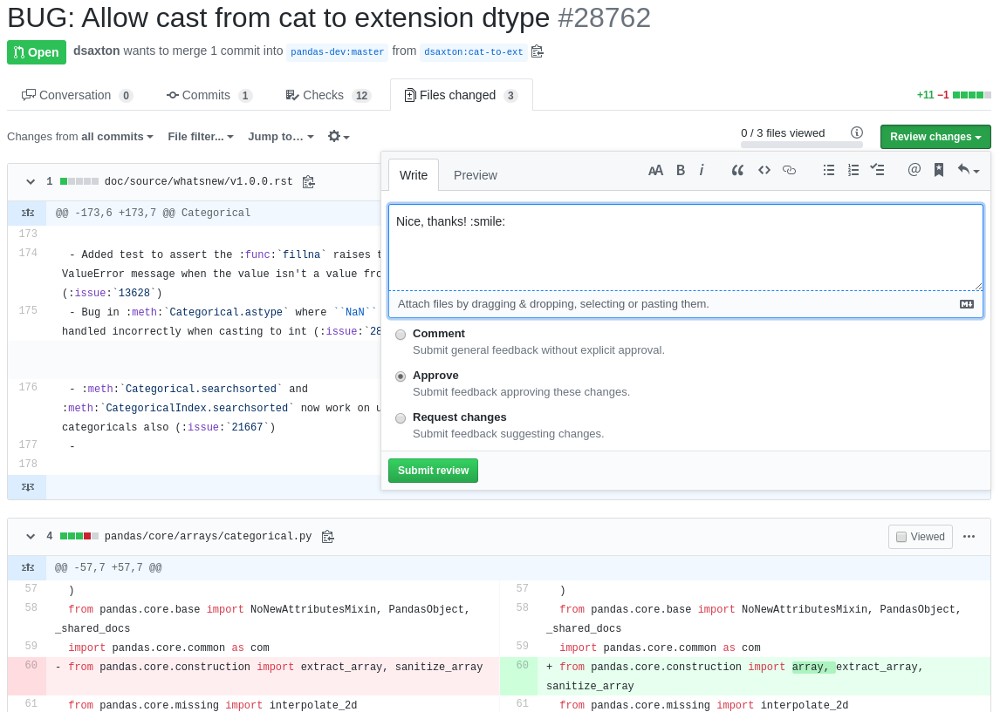{width=75%}

## Integración

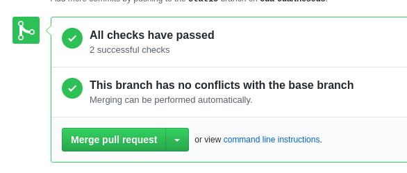{width=75%}

## Sincronización y limpieza

```bash
gitk --all &
```

```bash
git fetch upstream
git checkout master
git merge upstream/master
git push origin master
```

```bash
git branch -d <name>
git push origin :name
```

## ¿Merge commit?

. . .

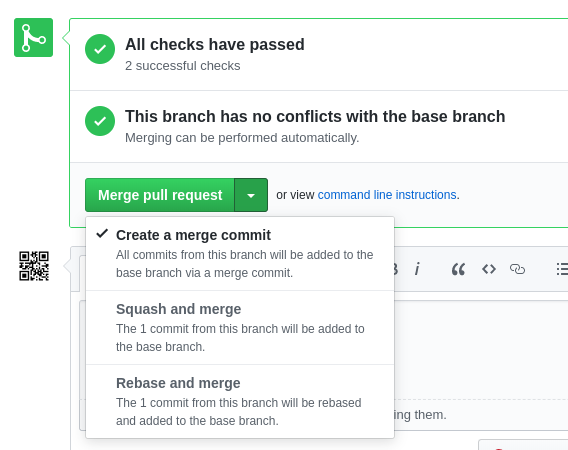

## `rebase` o no `rebase`

> *Esa es la cuestión...*

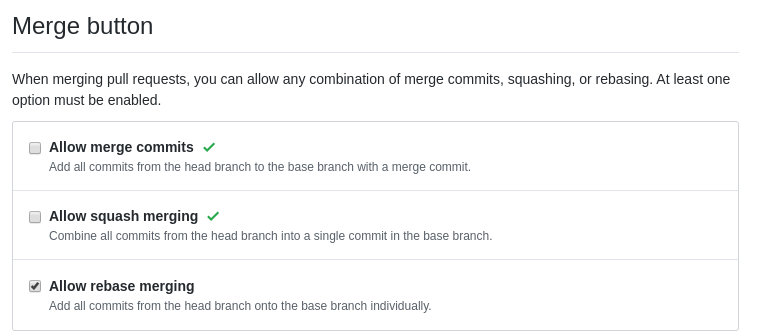


# Entornos virtuales :alien:

## [`venv`](https://docs.python.org/3/library/venv.html#creating-virtual-environments)

```
[other]$ python --version
Python 2.7.16
```

```
[other]$ python3 -m venv .venv
[other]$ source .venv/bin/activate
(.venv) [other]$ python --version
Python 3.6.9
```

## `requirements.txt`

```txt
pytest
```

```txt
pytest==5.2.0
```

> *También con rangos y condiciones*

## Instalación de dependencias

```
(.venv) [other]$ pip install -r requirements.txt
(.venv) [other]$ pytest --version
```


# Testeo :mag:

## ¿`pytest`?

## `test_mymodule.py`

```python
from my_module import get_ip


def test_get_ip_type():
    """The IP is expected to be a string."""
    ip = get_ip()
    assert isinstance(ip, str)


def test_get_ip_dots():
    """The IP(v4) is expected to have 4 dots."""
    ip = get_ip()
    assert ip.count('.') == 4
```

## `mymodule.py`

```python
import requests


def get_ip():
    """Get my current external IP."""
    return requests.get("https://icanhazip.com")
```

## Opciones

- **`-v`**
  - Algo más de información
- **`-x`**
  - Parar tras primer fallo
- **`-k token`**
  - Filtrar por "token"
- **`--pdb`**
  - entrar en consola de depuración! :smile:

## `requirements.txt`

```txt
requests

# Development
pdbpp
pytest
```

## Demostración :eyes:

`code/pytest-pdb/`

## *Pull request*! :tada:

- Tests
- Módulo
- Requisitos


# Integración continua :rocket:

## [Travis CI](https://travis-ci.org/)

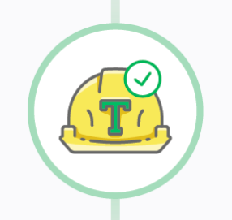

## Registro

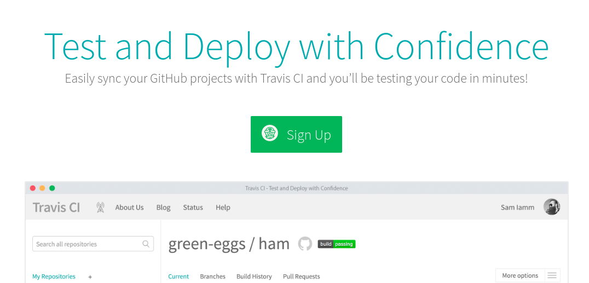

## Activación

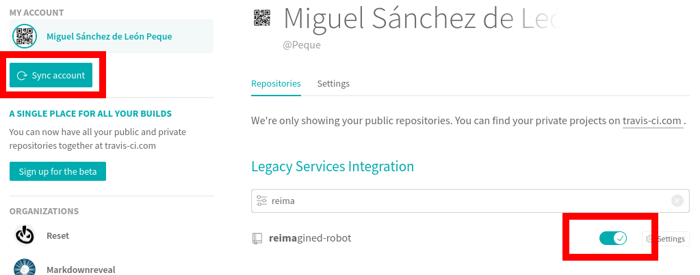

## `.travis.yml`

```yaml
dist: xenial

language: python

python:
  - 3.6

install:
  - pip install -r requirements.txt

script:
  - pytest -v
```

## *Pull request*! :tada:

- Configuración de Travis

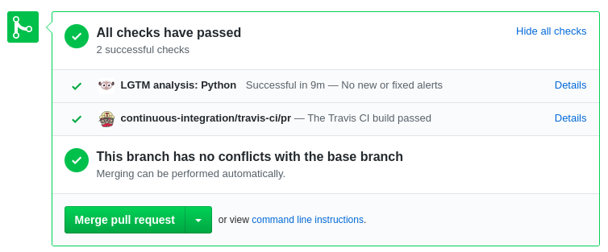


# Flecos y estilo :sunglasses:

## [`flake8`](https://github.com/pycqa/flake8)

`requirements.txt`

```txt
flake8
flake8-bugbear
pep8-naming
```

Uso:

```bash
flake8
```

## [Black](https://github.com/psf/black)

`requirements.txt`

```txt
black
```

Uso:

```bash
black . -l 79 --diff --check
black . -l 79
```

## `.travis.yml`

```yaml
script:
  - pytest -v
  - flake8
  - black . -l 79 --diff --check
```

## *Pull request*! :tada:

- Requisitos
- Configuración de Travis

## Otros

- `flake8-isort`
- [Mypy](http://www.mypy-lang.org/)
- Cobertura
- Seguridad
- Limpieza


# Documentación :book:

## [Sphinx](https://www.sphinx-doc.org)


## Sintaxis

```rst
Title
=====

Paragraph with `a link <https://domain.com>`_.

- Unordered
- List

.. code-block:: python

   print("Hello world!")
```

## Enlaces :link:

```rst
Pargraph with `a link`_.

.. _a link: https://domain.com
```

```rst
.. _label:

One section
-----------

This is the text of the section.


Another section
---------------

Refer to :ref:`label`.
```

## Otras directivas :heart_eyes:

```rst
.. warning:: This is a warning!
```

```rst
.. literalinclude:: path/to/code.py
   :lines: 1,3,5-10
   :emphasize-lines: 12,15-18
```

```rst
.. figure:: myfigure.svg
   :scale: 50 %
   :align: left

   Figure caption.
```

## Aún más

[Matplotlib :heart: Sphinx](https://matplotlib.org/sampledoc/extensions.html)

```rst
.. plot::

   import matplotlib.pyplot as plt
   import numpy as np

   x = np.random.randn(1000)
   plt.hist(x, 20)
   plt.title("Normal distribution")
   plt.show()
```

## ¡Y mucho más! :heart_eyes: :heart_eyes: :heart_eyes:

```rst
Mounting
--------

The mounting has been designed with `CadQuery`_. See the
`Bulebule 3D designs`_.

.. cadquery:: ../../3d/mount.py
   :select: mount
```

- [Visualization](https://bulebule.readthedocs.io/en/latest/building.html#mounting)

## Integrar Sphinx

`requirements.txt`

```txt
sphinx
```

## Plantilla de documentación

```bash
mkdir docs/
cd docs
sphinx-quickstart
```

```
> Separate source and build directories (y/n) [n]: y
> Project name: My Project
> Author name(s): My Name
> Project release []: 0.0.1
> Project language [en]: en
```

## Directorio :dart:

```
docs/
  make.bat
  Makefile
  build/
  source/
    index.rst
    conf.py
    _static/
    _templates/
```

## Generación

```bash
make html
```

## *Pull request*! :tada:

- Requisitos
- `docs/Makefile`
- `docs/source/`
- **Evitamos `docs/build`!** (`.gitignore`)


# Documentación en linea :earth_africa:

## *Gitlab Pages* :+1:

```yaml
pages:
  stage: deploy
  script:
    - python3.6 -m venv .venv
    - source .venv/bin/activate
    - pip install -r requirements.txt
    - make -C docs html
    - mv docs/build/html public
  artifacts:
    paths:
      - public
  only:
    - master
```

## *GitHub Pages* :sweat_smile:

???

[https://peque.github.io/PyConES-Spain-2019-tools/](https://peque.github.io/PyConES-Spain-2019-tools/)

## [Read the Docs](https://readthedocs.io)

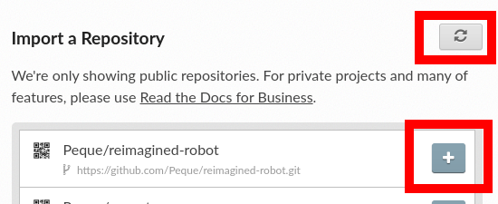


# ¿*CI* en local?

## [Tox](https://tox.readthedocs.io)

Instalación:

```bash
# Fuera del entorno
pip3 install --user tox
```

Uso:

```bash
tox
```

## `tox.ini`

```ini
[tox]
envlist = py37,py36,lint,docs
[testenv]
deps = -rrequirements.txt
commands = pytest --basetemp={envtmpdir} --cache-clear -v
[testenv:lint]
commands =
    black . --diff --check
    flake8
[testenv:docs]
whitelist_externals = make
commands =
    make -C docs html SPHINXOPTS="-W -E"
    make -C docs linkcheck
```

## `.travis.yml`

```yaml
dist: xenial
language: python
python:
  - 3.7
  - 3.6
matrix:
  include:
    - python: 3.6
      env: TOXENV=docs
    - python: 3.6
      env: TOXENV=lint
install:
  - pip install tox tox-travis
script:
  - tox
```

## *Pull request*! :tada:

- `tox.ini`
- `.travis.yml`


# Distribución de paquetes :package:

## [PyPI](https://pypi.org/)

## Directory structure

```
workshop/
  docs/
    source/
      ...
    Makefile
  mypackage/
    __init__.py
    mymodule.py
    tests/
      test_mymodule.py
  setup.py
  LICENSE
  README.md
```

## `setup.py`

```python
import setuptools

with open("README.md", "r") as fh:
    long_description = fh.read()

setuptools.setup(
    name="mypackage-username",
    version="0.0.1",
    author="My Full Name",
    author_email="me@mydomain.com",
    description="A small example package",
    long_description=long_description,
    long_description_content_type="text/markdown",
    url="https://github.com/myuser/workshop",
    packages=setuptools.find_packages(),
    classifiers=[
        "Programming Language :: Python :: 3",
        "License :: OSI Approved :: MIT License",
        "Operating System :: OS Independent",
    ],
    python_requires='>=3.6',
)
```

## [Twine](https://github.com/pypa/twine)

Construir:

```bash
python setup.py sdist bdist_wheel
```

Publicar:

```bash
twine upload --repository-url https://test.pypi.org/legacy/ dist/*
twine upload dist/*
```


# Más :chart_with_upwards_trend:

## `pytest`

- `fixture` (scopes)
- `mark.parametrize`
- `mark.skipif`
- `conftest.py`

## Otros gestores de entornos virtuales

- Conda
- Pipenv
- Poetry

## Ayuda al desarrollo

- Cobertura - [codecov.io](https://codecov.io)
- Limpieza - [codeclimate.com](https://codeclimate.com)
- Seguridad - [lgtm.com](https://lgtm.com/)


# ¡Eso es todo! :tada: :beers: :smile:

## [Hacktoberfest](https://hacktoberfest.digitalocean.com/)


## Thank you! :tada: :heart:
